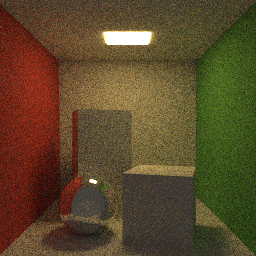
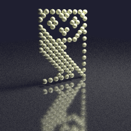
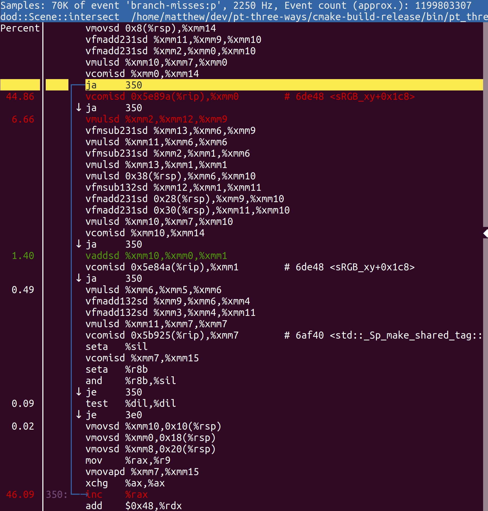
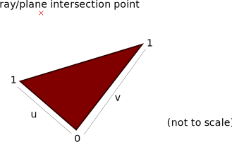
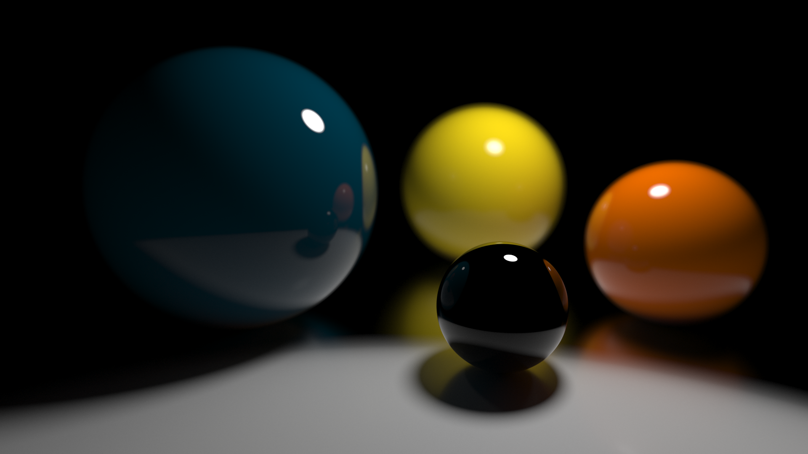

# Conclusions <!-- .element: class="white-bg" -->

---

<div class="white-bg">

### Favourite?

* All of the above!!
* C++ is best when we can blend all its features

</div>
  
---

<div class="white-bg">

### Performance

* Intel(R) Core(TM) i9-9980XE CPU @ 3.00GHz
* `cpupower frequency-set --governor performance`
* Single threaded
* GCC 9.2

</div>


---


<div class="white-bg">

### Cornell box scene 

<div class="float-left">

</div>
256x256 32spp (1 sphere, 38 triangles)

| Style | Render time (secs) |
| ----- | -- |
| Object Oriented | 72 |
| Functional | 82 |
| Data-Oriented | 72 |

</div>

---

<div class="white-bg">

### Owl scene

<div class="float-left"></div>

128spp (100 spheres, 12 triangles)

| Style | Render time (secs) |
| ----- | -- |
| Object Oriented | 96 |
| Functional | 101 |
| Data-Oriented | 64 |

</div>

---

<div class="white-bg">

### Suzanne

<div class="float-left">

</div>

256x256 8spp (2 spheres, 970 triangles)

| Style | Render time (secs) |
| ----- | -- |
| Object Oriented | 80 |
| Functional | 119 |
| Data-Oriented | 106 |

What on earth!?! <!-- .element: class="fragment" -->

</div>

---

### What happened? <!-- .element: class="white-bg" -->

---

##### Object oriented<!-- .element: class="white-bg" -->
```bash
   252,203,645,149   instructions    #    2.71  insn per cycle         
    23,158,824,048   branches        #  845.438 M/sec                  
       139,741,218   branch-misses   #    0.60% of all branches        
```
##### Functional<!-- .element: class="white-bg" -->
```bash
   238,866,691,159   instructions    #    1.78  insn per cycle         
    21,881,070,251   branches        #  560.513 M/sec                  
     1,105,066,725   branch-misses   #    5.05% of all branches        
```
##### Data-oriented Design<!-- .element: class="white-bg" -->
<pre><code class="bash" data-trim data-noescape>
   154,821,779,748   instructions    #    1.34  insn per cycle         
    10,353,392,805   branches        #  305.213 M/sec                  
<div class="fragment highlight-current-code" data-fragment-index="1">     1,242,670,094   branch-misses   #   12.00% of all branches        
</div></code></pre>
12% of all branches!?! <!-- .element: class="fragment white-bg" data-fragment-index="1" -->

---

 

---

<div class="container">
<div class="w45">
<pre><code class="cpp" data-trim data-noescape>
for (/* all triangles */) {
  auto u = calcU(/*...*/);
<div class="fragment highlight-current-code" data-fragment-index="1">  if (u &lt; 0 || u > 1) {
    continue;
  }
</div>  auto v = calcV(/*...*/);
  if (v &lt; 0 || u + v > 1) {
    continue;
  }
  auto dist = calcD(/*..*/);
  if (dist &lt; nearest) {
    nearest = dist;
  }
}
</code></pre></div>

<div class="w50" style="margin-top: 1em;">
<pre><code class="asm fragment" data-fragment-index="1" data-trim data-noescape>
vcomisd xmm14, xmm0 ; 0 >= u?
ja skip
vcomisd xmm0, [1.0] ; u >= 1.0?
ja skip
</code></pre>

<div style="background: white" class="fragment">

</div></div>

</div>

---

<div class="white-bg">

### Branch Prediction

<ul>
<li><code>u &lt; 0</code> unpredictable</li>
<li><code>u > 1</code> unpredictable</li>
<li class="fragment"><code>(u &lt; 0 || u > 1)</code> <i>should be</i> predictable*</li>
<li class="fragment"><code>(u &lt; 0 || u > 1 || v &lt; 0 || u + v > 1)</code> more so</li>
</ul>

<div class="fragment">* Provided compiler combines conditions...<br>
<code class="fragment">(u &lt; 0) | (u > 1) | ...</code>
</div>

</div>

---

<div class="white-bg">

<div class="lhs">

```cpp
auto u = calcU(/*...*/);
if (u < 0 || u > 1) {
  continue;
}
auto v = calcV(/*...*/);
if (v <  0 || u + v > 1) {
  continue;
}
```

</div>

<div class="rhs">

```cpp
auto u = calcU(/*...*/);
auto v = calcV(/*...*/);
if ((u < 0) | (u > 1) 
    | (v < 0) | (u + v > 1)) {
  continue;
}
```

</div>

</div>

---

<div class="white-bg">

### FINAL STATS

Suzanne DoD: 106s &rarr; 68s (36% faster)

</div>

---

<div class="white-bg">

### FINAL STATS

| Scene   | OO | FP | DoD |
| -----   | -- | -- | --- |
| Cornell | 72 &rarr; 64 | 82 &rarr; 64 | 72 &rarr; 56 |
| Owl     | 96 &rarr; 96 | 101 &rarr; 100 | 64 &rarr; 64 |
| Suzanne | 80 &rarr; 104 (!) | 119 &rarr; 82 | 106 &rarr; 68 |

</div>

---

<div class="white-bg">

### If I had more time...

* Code on [GitHub](https://github.com/mattgodbolt/pt-three-ways)
* Threading
* Devirtualisation
* Future directions...
* DoD improvements
* Thanks

</div>

---

### GO WRITE SOMETHING COOL! <!-- .element: class="white-bg" -->

