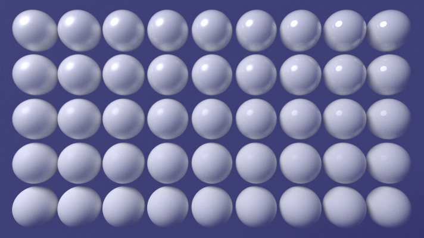

## Functional Programming

---

## Functional Programming

* `ranges_v3`
* `tl::optional`

---

### Scene <!-- .element: class="white-bg" -->

<pre><code class="cpp" data-trim data-noescape>
struct TrianglePrimitive {
  Triangle shape;
  Material material;
};

struct SpherePrimitive {
  Sphere shape;
  Material material;
};

using Primitive = std::variant&lt;TrianglePrimitive, SpherePrimitive>;

</code></pre>

---

### Render <!-- .element: class="white-bg" -->

<pre><code class="cpp" data-trim data-noescape>

auto renderOnePixel = [...](auto tuple) {
  auto [y, x] = tuple;
  std::mt19937 rng(...);
  return radiance(scene, rng, 
        camera.randomRay(x, y, rng), 0, renderParams);
};

return ArrayOutput(width, height, 

  view::cartesian_product(view::ints(0, height),
                          view::ints(0, width))

  | view::transform(renderOnePixel));

</code></pre>

---

### Radiance <!-- .element: class="white-bg" -->

<pre><code class="cpp" data-trim data-noescape>

auto radianceForRay = [&](const Ray &ray) {
  return radiance(scene, rng, ray, depth + 1, renderParams);
};

const auto incomingLight = accumulate(

    views::cartesian_product(views::ints(0, numVSamples),
                             views::ints(0, numUSamples))

        | views::transform(toUVSample)

        | views::transform([&](auto s) {

            return radianceAtIntersection(
                radianceForRay, *intersectionRecord,
                ray, s.first, s.second, unit(rng));

          }),
    Vec3());
</code></pre>

---

<pre><code class="cpp" data-trim data-noescape>
template &lt;typename RadianceFunc>
Vec3 radianceAtIntersection(
        RadianceFunc &&radiance,
        const IntersectionRecord &intersectionRecord,
        const Ray &ray, double u, double v, double p) {
  // [...lots of material stuff...]
  if (p < reflectivity) {
    const auto newRay =
        Ray(hit.position, coneSample(/*...*/, u, v));
    return radiance(newRay);
  } else {
    const auto newRay = Ray(hit.position, 
        hemisphereSample(/*...*/, u, v);
    return mat.diffuse * radiance(newRay);
  }
}
</code></pre>

---

### Intersection <!-- .element: class="white-bg" -->

<pre><code class="cpp" data-trim data-noescape>
struct IntersectVisitor {
  const Ray &amp;ray;

  template &lt;typename PrimT>
  auto operator()(const PrimT &primitive) const {
    return primitive.shape.intersect(ray)
        .map([&primitive](auto hit) {

            return IntersectionRecord{hit, primitive.material};

        });
  }
};

tl::optional&lt;IntersectionRecord> intersect(
    const Primitive &primitive, const Ray &ray) {
  return std::visit(IntersectVisitor{ray}, primitive);
}

</code></pre>

---

<pre><code class="cpp" data-trim data-noescape>
tl::optional&lt;Hit> Sphere::intersect(const Ray &ray) const noexcept {
  const auto determinant = /*...maths...*/;
  return safeSqrt(determinant)

      .and_then([&b](double root) -> tl::optional&lt;double> {
        /* ...calc minusT, plusT.. */

        if (/* ...too close to zero...*/)
          return tl::nullopt;

        return minusT > Epsilon ? minusT : plusT;

      })

      .map([this, &ray](double t) {

        return Hit{t, /*...*/};

      });
}
</code></pre>

---

### Things I liked

* `const` `:allthethings:`
* Code clearer...maybe?
* Testability

---

### Things I didn't like

* Cryptic compiler error messages
* Concern I've broken FP rules (`rng`...)
* Performance
  - `std::mt19937 rng` per pixel?

