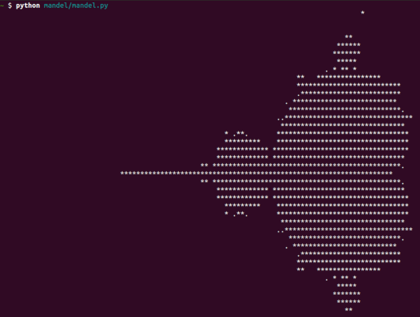
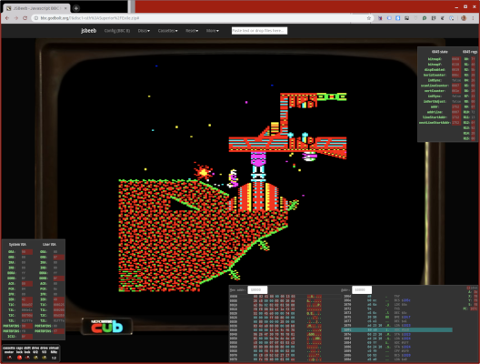
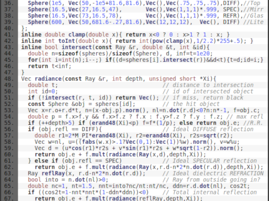
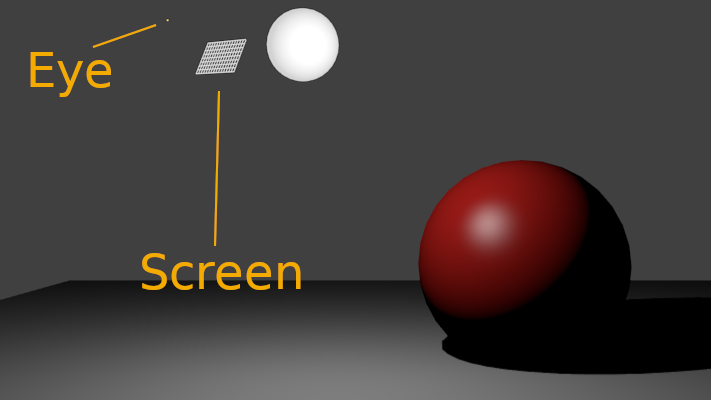
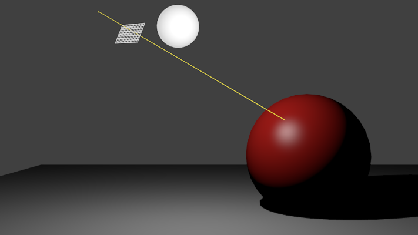
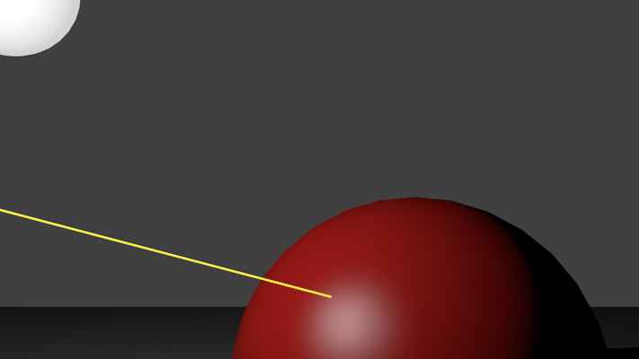
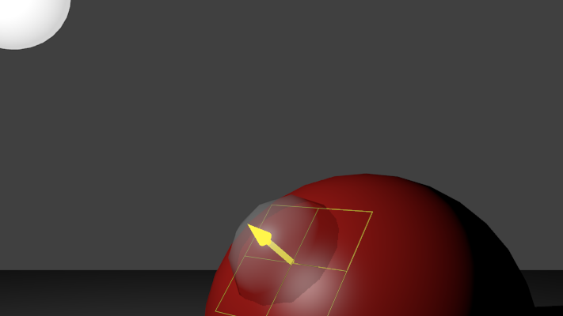
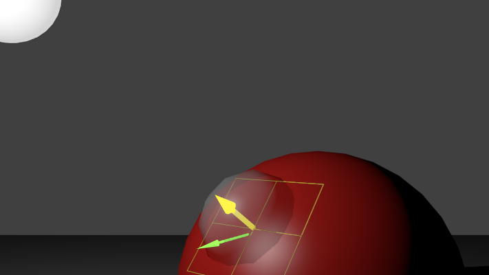
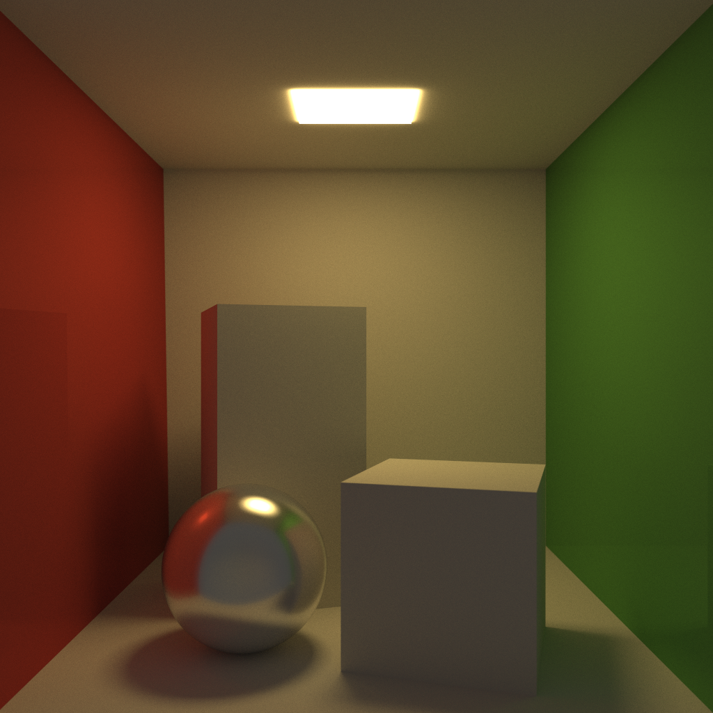

## A story

### Apply to C++ <!-- .element: class="fragment" -->

<aside class="notes">
Hi everyone, welcome to my talk. This is going to be a story firstly and foremostly about C++ and how multi-paradigm it really is.

It's also my first actual *language* talk about C++, and so I'm pretty nervous about exposing how bad my C++ coding really is. Up until now I've mostly only shown snippets of pretty much C code, lots of assembly, and a bit of Javascript.

By nature I'm very much a traditional "OO" C++ programmer, but I wanted an excuse to learn a little bit more of the functional programming point of view, and to explore what's being called "Data oriented Design". 

I'm often asked "how do I learn C++?" and my stock answer is how I've learned other languages along my career: find something relative simple but fun to write in that language and give it a go. My suggestions are usually things like Mandelbrot generators, or emulators or path or ray tracers. Things that aren't _too_ much work but have pretty results.

To learn the "new" "FP" C++ or "DoD" C++ I decided to take my own advice and wrote a path tracer. Three times. Well, more, depending on how you count it.

I guess this is also a story about how cool and exciting graphics programming is. Way back in the late 90s and early 2000s I was a games programmer, and I don't think I realised how much I missed it. Me writing the slides for this talk got delayed time and time again as I tweaked the code and re-rendered things and burnt lots of cash on AWS...

</aside>

---

## This talk is NOT

* Expert advice on:
  * Path tracing
  * C++ code styles
* Style "X" is best!

<aside class="notes">
Before we go too much further I have an admission: this talk is NOT quite a lot of things.

I AM NOT AN EXPERT AT ANY OF THIS!

This talk is not to be considered advice in general on how to do path tracing, or expert advice on the various C++ code styles. The code is quite a caricature in some places, and that's a little to prove a point and to winkle out the differences in style. Nobody really writes code that looks like this. This is also not a manifesto of mine on which style is best. It's a counterpoint of them all, and what we can learn from widening our minds and viewing coding problems through different lenses.
</aside>

---

## But it is

* My interpretation
* Real code
* Interesting & fun (hopefully)<!-- .element: class="fragment" -->

---

## Styles

* Object Oriented <!-- .element: class="fragment" -->
* Functional Programming <!-- .element: class="fragment" -->
* Data-Oriented Design <!-- .element: class="fragment" -->

<aside class="notes">

### OO
Model the problem as a hierarchy of "objects". Behaviour attached to objects directly through vtables.

### FP
Model the problem as simple immutable data, behaviour in free functions. Function overloading for polymorphism.

### DoD
Work backwards from the operations, designing the data around most common operations

</aside>

---

## Path tracing

Image credit: <a href="http://www.kevinbeason.com/smallpt/">Kevin Beason</a>

<aside class="notes">
This is the kind of image path tracing can produce. This wasn't made by my code, but from a mostly readable C++ implementation of path tracing that fits in 99 lines, called smallpt.

I show this not because it's a cool image (although it is), but to demonstrate what I mean when I say a relatively small amount of code. This kind of thing is a lot of bang for buck, right?
</aside>

---

## Path tracing

Image credit: <a href="http://www.kevinbeason.com/smallpt/">Kevin Beason</a>

---

## Path tracing

---

## Path tracing

<aside class="notes">
What's going on? You've probably heard of ray tracing: path tracing is a generalised form of ray tracing which produces more accurate images but at a vastly increased cost.

In path tracing we fire a ray out of every pixel on screen and see what it hits. So far, this is the same as ray tracing. Once we've found what it hits, we pick a random direction that light _might_ have reached that point and continue casting on and on and on until we either hit something that's intrinsically "bright", or we run out of patience (and give up).

We then colour that pixel on the colour of the emissive surface, taking into account all the colours of the surfaces it bounced on the way.

Of course, that's only one of the near-infinite paths that light could have traveled to reach our pixel. So we do it a bunch more times and average over all the possible light paths to get our final colour.

We do that for every pixel, and voila! We have a pretty image!
</aside>

---

## Path tracing

---

## Path tracing

---

## Path tracing

---

## Path tracing

---

## Path tracing

For each pixel:

1. Fire a zillion rays into the scene<!-- .element: class="fragment" -->
2. Bounce randomly; accumulate intensity & colour<!-- .element: class="fragment" -->
3. Average them out<!-- .element: class="fragment" -->

---

## My path tracer

* Simple materials
* Spheres & triangles only
* Scenes in code
* Written 3 times!

<aside class="notes">
My path tracer is slightly more advanced than smallpt, supporting more than just spheres (barely), different scenes (defined in code), slightly more sophisticated materials, but not transparency.

Of course, I had to write it three times too! I learned it's really hard to ignore your instinct to de-duplicate similar code. There's a fair amount of similar code, but having it duplicated made it easier to morph each implementation in a more idiomatic version for that style of code.

</aside>

---

## My path tracer

Model credit: "Suzanne" from Blender With thanks to <a href="https://michaelfogleman.com">Michael Fogleman</a>

---

## General approach

* Shared basic math library
  * `Vec3` / `Norm3`
  * `Ray`
  * `Hit`
* Some simple "util" classes
  * `MaterialSpec` struct
  * `Camera`

